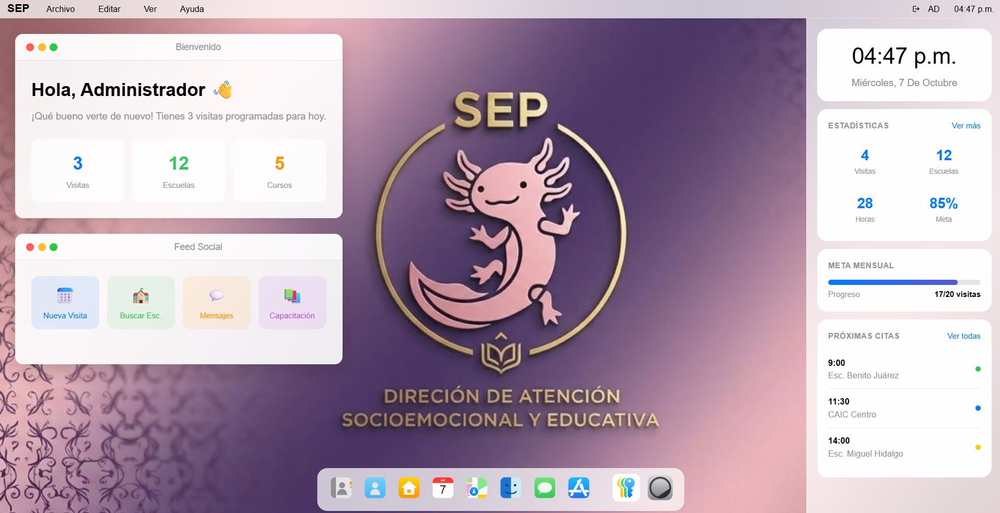

# Plataforma de Gestión Psicoeducativa

Aplicación web demostrativa para organizar, supervisar y analizar actividades de acompañamiento psicoeducativo en instituciones educativas.

## Vista previa



## Funcionalidades

- Dashboard con indicadores de seguimiento.
- Gestión de escuelas, psicólogos y personal administrativo.
- Agenda y registro de visitas.
- Mapas de cobertura geográfica.
- Gestión de documentos.
- Generación de oficios y conversión de DOCX a PDF.
- Configuración y administración del sistema.

## Tecnologías

- Frontend: HTML5, CSS3, Sass y JavaScript.
- Backend: Node.js, Express y Multer.
- Documentos: LibreOffice.

## Requisitos

- Python 3 o PHP para ejecutar el frontend.
- Node.js y npm para ejecutar el backend.
- LibreOffice para convertir documentos a PDF.

## Instalación y ejecución

### Frontend

Desde la raíz del proyecto:

```bash
bash start.sh
```

Abrir en el navegador:

http://localhost:8080/src/html/login.html

### Backend

En otra terminal:

```bash
cd server
npm install
npm start
```

Servidor disponible en:

http://localhost:3001

## Acceso de demostración

- Correo: admin@example.com
- Contraseña: admin123

La autenticación es demostrativa y no está diseñada para producción.

## Datos y privacidad

Todos los registros de usuarios, escuelas, profesionales y actividades son ficticios y se utilizan exclusivamente para demostración.

Este proyecto es independiente y no representa un sistema oficial de la Secretaría de Educación Pública.

Los documentos generados carecen de validez oficial.

## Autor

Marco Antonio Hernández Baños

GitHub: https://github.com/MarkBettley

LinkedIn: https://www.linkedin.com/in/marco-hernandez-baños
